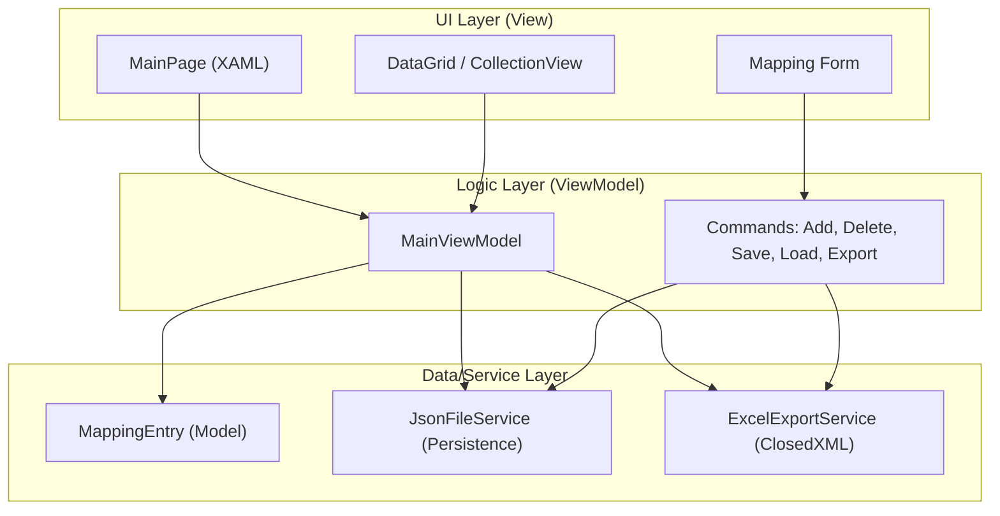

# 🗺️ Source-to-Target Mapping Documentation Generator (STTM Gen)


> **A professional desktop application for ETL consultants and data migration engineers** — Eliminate hours of manual Excel work with a clean, guided GUI for documenting complex source-to-target mappings.

---

## 🎯 Overview

**STTM Gen** is a cross-platform desktop application built with **.NET MAUI** and **C#** for **ETL (Extract, Transform, Load)** and **data migration** professionals.  
It provides a structured and persistent way to document the **Source → Target** mapping process, simplifying a traditionally error-prone and manual task into an efficient, auditable workflow.

### 🌟 Key Features

- **🧩 Visual Mapping Interface** — Form-based entry for `Source Table/Column → Target Table/Column`
- **💡 Transformation Logic** — Document SQL or business rules with rich text fields
- **📑 Business Rule Tracking** — Attach data quality and validation rules to mappings
- **🔢 Data Type Controls** — Define and confirm column types via dropdowns
- **💾 Project Persistence** — Save and load projects as readable `.sttm.json` files
- **📊 Live Mapping Grid** — Real-time DataGrid displaying all mappings
- **📄 Excel Export (ClosedXML)** — Generate client-ready, formatted documentation
- **🗑️ Record Management** — Edit, delete, and clear mapping entries

---

## 🎬 Screenshots

### 📺 Main Interface

| Mapping Form | Real-time Grid |
|:-------------:|:---------------:|
|  |  |

---

## 🚀 Quick Start

### Prerequisites

- **.NET 8 SDK** (or newer)
- **Visual Studio 2022** with the **.NET Multi-platform App UI development** workload installed

### 1️⃣ Clone the Repository

```bash
git clone https://github.com/yourusername/sttm-documentation-generator.git
cd sttm-documentation-generator
```

### 2️⃣ Restore Dependencies

```bash
dotnet restore
```

### 3️⃣ Run the Application

```bash
# Run for Windows
dotnet build -t:Run -f net8.0-windows10.0.19041.0
```

Or simply open the solution in **Visual Studio** and press **F5**.

### 4️⃣ Start Documenting

1. Enter **Source Table** and **Source Column** details  
2. Enter **Target Table** and **Target Column** details  
3. Add **Transformation Logic** and **Business Rules**  
4. Click **Add Mapping**  
5. View entries in the grid and export to Excel

---

## 🏗️ Architecture

### System Overview


---

## 🧰 Tech Stack

### Core Technologies
- **C# 10+** — Primary programming language  
- **.NET MAUI** — Cross-platform UI framework  
- **MVVM** — Model-View-ViewModel architecture  
- **System.Text.Json** — Project persistence  

### Key Libraries
- **ClosedXML** — Excel export for polished documentation  
- **CommunityToolkit.MVVM** — ObservableObject, RelayCommand utilities  
- **Newtonsoft.Json** — Optional serialization support  

---

## 📋 Use Cases

- **ETL Project Documentation** — Create standardized mapping deliverables  
- **Client Hand-offs** — Provide transparent data mapping records  
- **Knowledge Transfer** — Facilitate internal documentation  
- **Audit & Compliance** — Record transformation logic for validation  

---

## 🧪 Testing

### Manual Testing Checklist

- [ ] Add and save new mappings  
- [ ] Load saved `.sttm.json` project  
- [ ] Export Excel successfully  
- [ ] Verify Excel formatting  
- [ ] Test data type dropdown functionality  
- [ ] Confirm delete/clear actions  
- [ ] Validate JSON persistence structure  
- [ ] Check error handling for invalid inputs  

---

## 📦 Distribution

### Creating an Executable

#### Windows (MSIX)

```bash
# Publish self-contained executable
dotnet publish -c Release -r win10-x64 --self-contained true
```

#### macOS (DMG or App Bundle)

```bash
dotnet publish -c Release -r osx-arm64 --self-contained true
```

#### Linux (AppImage)

```bash
dotnet publish -c Release -r linux-x64 --self-contained true
```

Executables will appear in the `/publish` directory.

---

## 🛠️ Troubleshooting

### Common Issues

#### ❗ Missing Workload
```bash
dotnet workload install maui
```

#### ❗ Excel Export Error
Make sure **ClosedXML** is installed and compatible with your .NET SDK:
```bash
dotnet add package ClosedXML
```

#### ❗ JSON Save Error
Check that the project directory has write permissions.

---

## 🔍 Use Cases

### 1. Migration Documentation
Document mappings for Docebo, Cornerstone, or other LMS/LRS migrations.

### 2. Business Rule Cataloging
Store and version transformation and validation logic alongside data flow.

### 3. Consulting Deliverables
Generate clean Excel mapping documents for clients and audits.

---

## 📈 Performance & Limitations

| Project Size | Load Time | Excel Export | File Size |
|:-------------:|:----------:|:-------------:|:-----------:|
| 100 mappings  | < 1s | < 1s | ~200 KB |
| 500 mappings  | < 2s | < 2s | ~1 MB |
| 1000 mappings | < 4s | < 4s | ~2 MB |

**Known Limitations:**
- No schema auto-import (planned)
- Manual data entry (for transparency)
- Excel-only export (PDF planned)

---

## 🔮 Future Enhancements

- [ ] **Schema Import** from CSV/DB connections  
- [ ] **Data Lineage View** visualization  
- [ ] **Duplicate Detection** and validation  
- [ ] **PDF/HTML Export** options  
- [ ] **Cloud Sync** for mapping archives  

---

## 📄 License

**Proprietary Demo License**

Copyright (c) 2025 **MonteyAI LLC**

This project is released under a **proprietary demonstration license**.  
It is intended for educational and proof-of-concept use only.

### Quick Summary

✅ **Allowed:** Viewing, learning, portfolio and educational use  
❌ **Not Allowed:** Commercial redistribution or production deployment  
⚠️ **Disclaimer:** Provided “AS IS” without warranty of any kind

See the full [LICENSE](LICENSE) for complete terms.

---

## 💼 Commercial Licensing

Interested in using this application commercially?

📧 **Contact:** smontecinos@monteyai.com  
🌐 **Website:** [https://monteyai.com](https://monteyai.com)  
🏢 **Company:** MonteyAI LLC

---

## 🤝 Contributing

### Development Setup

```bash
# Fork and clone
git clone https://github.com/yourusername/sttm-documentation-generator.git
cd sttm-documentation-generator

# Create feature branch
git checkout -b feature/your-feature-name

# Build and test
dotnet build
dotnet run
```

### Guidelines
- Follow C# coding conventions  
- Include XML comments for public methods  
- Test ViewModel logic before PR submission  
- Keep commits atomic and well-documented  

---

## 🙏 Acknowledgments

- **Microsoft .NET MAUI Team** — for the cross-platform framework  
- **ClosedXML Developers** — for Excel export capabilities  
- **Community Toolkit MVVM** — simplifying UI logic binding  

---

## 📞 Contact & Support

- **Issues:** [GitHub Issues](https://github.com/yourusername/sttm-documentation-generator/issues)  
- **Discussions:** [GitHub Discussions](https://github.com/yourusername/sttm-documentation-generator/discussions)  
- **Email:** smontecinos@monteyai.com  

---

<div align="center">

**Made with 💻 by MonteyAI for ETL and Data Migration Professionals**

⭐ Star this repository if you find it helpful!

[Report Bug](https://github.com/yourusername/sttm-documentation-generator/issues) · [Request Feature](https://github.com/yourusername/sttm-documentation-generator/issues) · [Documentation](https://github.com/yourusername/sttm-documentation-generator/wiki)

</div>
